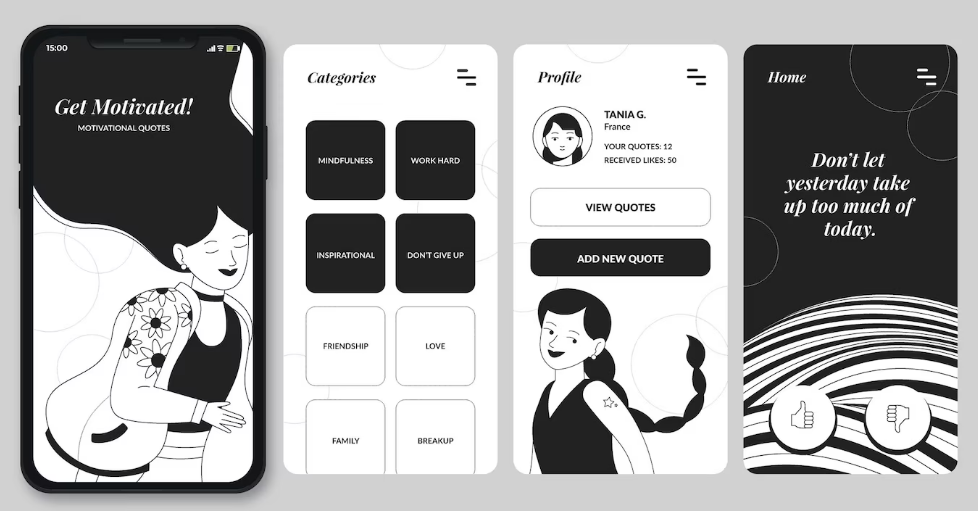

# Projeto Mobile Flutter
 
O objetivo deste projeto é criar uma plataforma digital que forneça uma coleção de notas de autoajuda, organizadas de forma acessível, para ajudar os usuários a melhorar sua saúde mental, bem-estar e qualidade de vida. As notas de serão escritas pelo próprio usuário, como uma espécie de bloco de notas
 
# Mockup do projeto
 

 
## Funcionalidades
 
### Tela de login:
- Input de email
- Input de senha
- Botão cadastrar-se
- Botão entrar
 
### Tela de cadastro do usuário:
- Input de email
- Input de senha
- Input nacionalidade
- Input foto de perfil
- Botão voltar
- Botão entrar
 
### Tela de categorias:
- Botão para categoria
 
### Tela de perfil:
- Foto de perfil
- Nacionalidade
- Quantidade de notas
- Quantidade de notas avalidadas
- Visualizar todas as notas
- Adicionar nova nota
- Adicionar categorias
 
### Tela home:
- Visualizar notas
- Like em nota
- Dislike em nota
 
### Menu lateral:
- Foto de perfil
- Nome do usuário
- Navegar p/ perfil
- Navegar p/ home
- Navegar p/ categorias
- Sair do aplicativo
 
## Como usar
 
(Em breve)
 
## Desenvolvedora do Projeto
 
- Milene Lima
 
### Informações adicionais
 
- O projeto está em fase de desenvolvimento, podendo ser adicionado mais funcionalidades para se tornar completo.
Última atualização: 27/09/2023